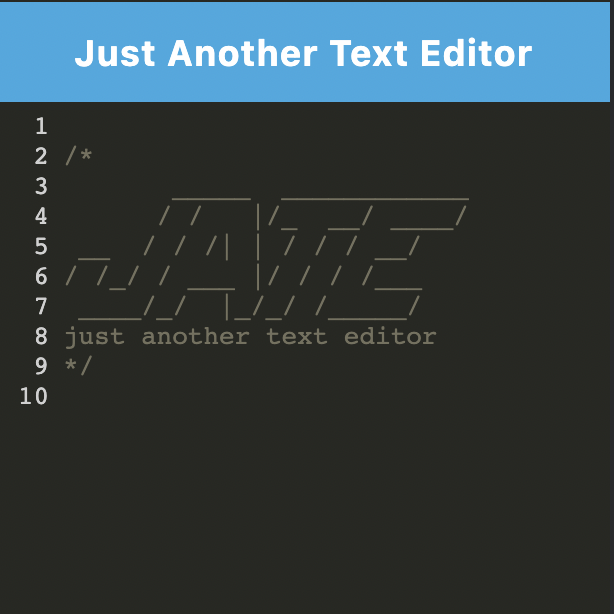

# Text-Editor-PWA
  
  
  
  
  
  
  
  
  
  ## Description
  
 This application takes a pre-made text-editor and converts it to a PWA. Originally the app used local storage to persist data, no additionally uses IndexedDb
 Javascript files have been bundled using webpack to ensure functionality across all browsers. As a fully functioning PWA, the application can be installed on local machine
 and can be used with full functionality offline. Through the use of service workers the application caches several resources to optimize performance.
 
 
 
 [Deployed Application](https://just-another-text-editor-pwa.herokuapp.com/)
 
  [GitHub Repo](https://github.com/IvanFelipeEscobar/Text-Editor-PWA)
 
 
 
 ## Credit
 
 Text editor provided by edX Boot Camps LLC
 
 PWA functionality by [Ivam Felipe Escobar](https://github.com/IvanFelipeEscobar)
 
